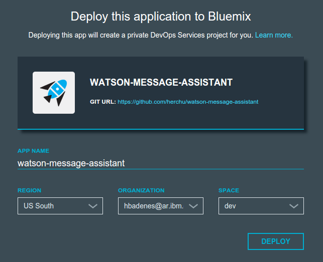
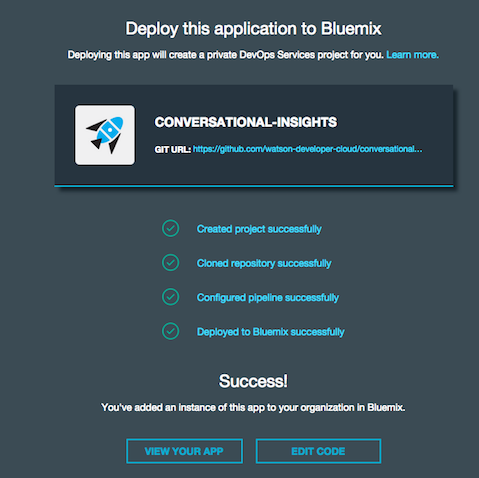
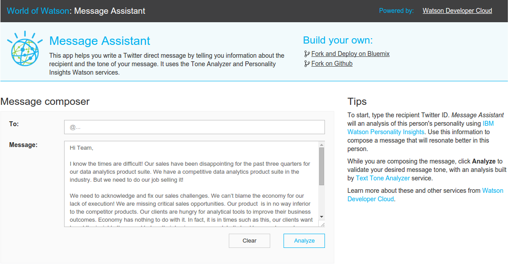
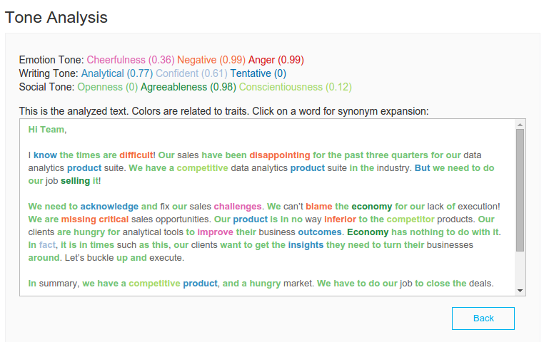
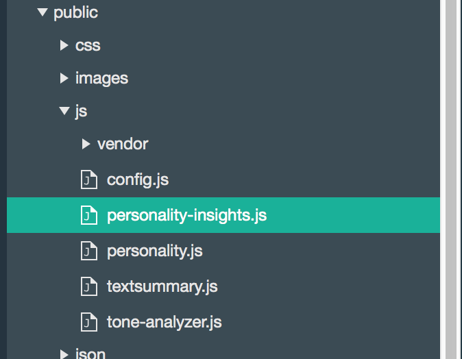
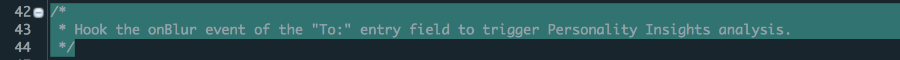
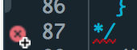
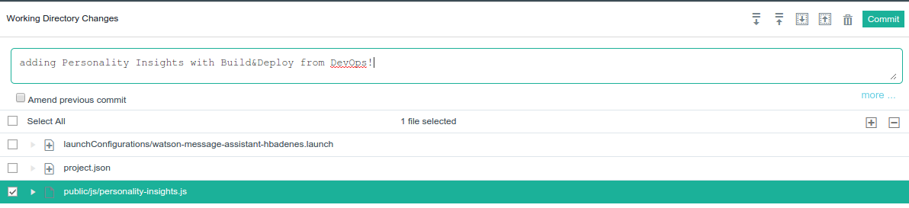
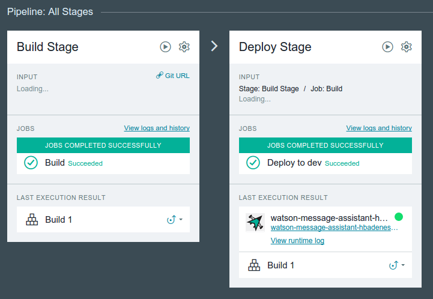
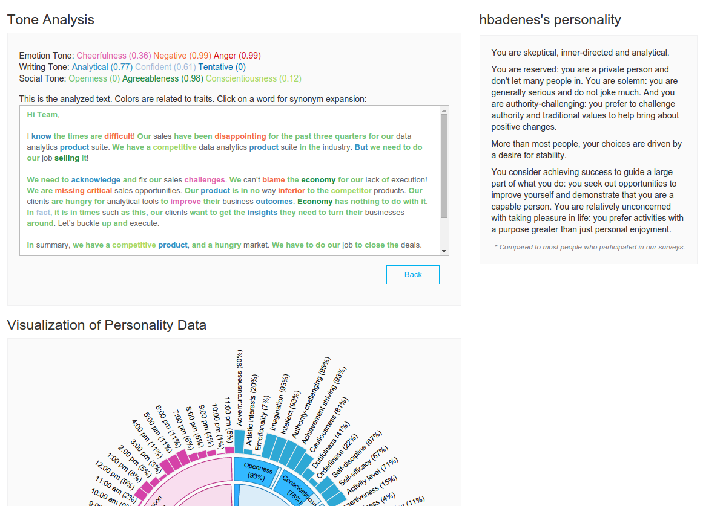

# World of Watson Labs - Conversational Insights

 Conversational Insights helps you write a Twitter direct message by telling you information about the recipient and the tone of your message. It uses the Tone Analyzer and [Personality Insights][pi_service] Watson services.

This demo is part of a Drop In Lab during World of Watson 2015 at NYC.
You may also want to follow the other labs to learn about other Watson services like Visual Recognition or Tradeoff Analytics:
 * [Image Analysis](https://github.com/watson-developer-cloud/image-analysis): Visual Recognition and Machine Translation.
 * [Personalized recommendations](https://github.com/watson-developer-cloud/personalized-recommendations): Concept Insights, Question and Answer and Tradeoff Analytics.

So let’s get started. The first thing to do is to build out the shell of our application in Bluemix.

## Creating a IBM Bluemix Account

  1. Go to [https://ace.ng.bluemix.net/](https://ace.ng.bluemix.net/)
  2. Create a Bluemix account if required.
  3. Log in with your IBM ID (the ID used to create your Bluemix account)

**Note:** The confirmation email from Bluemix mail take up to 1 hour.

## Deploy this sample application in Bluemix

  1. Click the button below to fork the project into IBM DevOps Services and deploy your own instance of this application on [IBM Bluemix][bluemix].

  

  2. From here you will be taken to a Bluemix page, where you will be prompted to name your app. A sample name is provided for you, but feel free to give your application any name you like (if the name is taken by another user you will be prompted to try another name).

  

  **Note:** Use the default settings for Region / Organization / Space on the Bluemix landing page.

  3. Once you have named your application, click the deploy button to begin the deploy process to Bluemix. During this process, Bluemix will automatically build and deploy our starter application based on the Github repository that we accessed at the start of the lab.

  4. Once the application has finished deploying, you will see a "Success!" message. At this point, scroll to the top of the page and select "Dashboard" from the header bar.

  

 
## Test out the application

Now that we have deployed our application to Bluemix, the next step is to test out the application in its current state. Afterwards we will build out more functionality into the application.

To launch the application, click the link next to "Routes" which should follow the naming convention *\<your app name\>*.mybluemix.net

  

This demo simulates you are composing a direct message to a twitter user. You will see a pre-populated text in the message. To inspect the starter application that we will be adding onto, select “Analyze”

  
  
The Watson Tone Analyzer service will show a report or your message's tone in various dimensions. This helps you understand how the recipient will receive the message: are you being too negative? Overly confident, cheerful? This service can also suggest synonyms for replacements, if you want to customize your message by going higher or lower in the different traits measured. Click on any colored word to get a list of suggested synonyms.

We are going to demonstrate how easy it is to use the Watson services on Bluemix to add functionality to existing applications. 

While this application already uses Watson cognitive capabilities by understanding your message's tone, we are also adding an understanding of the recipient's as an individual to better help you compose a message that resonates on him/her.

  
We are going to demonstrate how easy it is to use the Watson services on Bluemix to add functionality to existing applications. Our current application analyzes the tone of a message. However let's say we also want to know the message recipient's individual characteristics, like personality, so that we can tune the message for this person.

Luckily, we’ve already started the process to do this. To fully implement the recipient's analysus we are going to edit our application code to use the [Personality Insights] service analysis.
  
## Modify the existing application

  1. Let’s edit our source code. Back on the application home page in Bluemix, you will see a link to the Jazz Hub repository, and a button to **Edit Code**.
  Click on **Edit Code.**

  2. Clicking on Edit Code will take you to the Jazz Hub repository, which will allow us to edit and push new versions of our code to the application.
  
 3. Within the repository, navigate to `public/js/personality-insights.js` and open that file to view the application source code.

  

 4.  Locate the comment starting in line 43: "Hook the onBlur event ....". Close this comment, and remove the comment closing mark “*/” which appears after function `startPersonalityAnalysis()` in line 87.

  

  

Note that now the new function listens for the onBlur event of the “To:” entry field. When you type a twitter screen name, it will GET an API URL in the application, which first imports the twitter data of this user, then uses the Personality Insights API to analyze its personality traits. The UI will now show a summary of the recipient's personality with a visualization when you type the user name.

 5. Click on File -> Save or press Crt+S.
  

## Deploy

  1. The last step in order to complete our application is to deploy our changes to Bluemix. To do this, we need to push our new code to the application. In the code editor screen, switch to the Git view, the 2nd icon in the left navigation bar.

  

  2. Locate your change to `personality-insights.js` file. Check it (select it), add a commit message, and click **Commit**.

  

  3. Click **Sync** to send your changes from this workspace to the main repository and trigger a deploy of your app.

  

  4. Finally, Click on **Build and Deploy** to see the deploy process.

  

**Note:** While this may show as overly complicated, we show it here to illustrate you can have exactly the same source management practices you could have your local environment connected to a Git repository, in the Bluemix DevOps environment.

## Test

To test out our application, navigate back to your application homepage on Bluemix. Select the URL next to “Route” in the same way that we launched our previously unfinished application before.

  

# Congratulations 

You have completed the Conversational Insights Lab! :bowtie:

[bluemix]: https://console.ng.bluemix.net/
[wdc_services]: http://www.ibm.com/smarterplanet/us/en/ibmwatson/developercloud/services-catalog.html
[pi_service]: http://www.ibm.com/smarterplanet/us/en/ibmwatson/developercloud/personality-insights.html
